# examen-microservices-distributed-systems


|ENSET-M|II-BDCC 2|EL AAMIRI Essadeq|
|---|---|---|

Développer les fonctionnalités qui vous semblent les plus importantes pour ce projet et rendre un
rapport et le code source de l’application répondant aux questions suivantes :


<!-- vscode-markdown-toc -->
* 1. [Command side](#Commandside)
	* 1.1. [Commands](#Commands)
	* 1.2. [Events](#Events)
	* 1.3. [Dtos](#Dtos)
	* 1.4. [Aggregate](#Aggregate)
	* 1.5. [Controller](#Controller)
	* 1.6. [Tests](#Tests)
* 2. [Query side](#Queryside)
	* 2.1. [Queries](#Queries)
	* 2.2. [Entities](#Entities)
	* 2.3. [Repositories](#Repositories)
	* 2.4. [Eventhandler Service](#EventhandlerService)
	* 2.5. [Queryhandler Service](#QueryhandlerService)
	* 2.6. [Controllers](#Controllers)
	* 2.7. [Tests](#Tests-1)
* 3. [Command side](#Commandside-1)
	* 3.1. [Commands](#Commands-1)
	* 3.2. [Events](#Events-1)
	* 3.3. [Aggregates](#Aggregates)
	* 3.4. [Controllers](#Controllers-1)
	* 3.5. [tests](#tests)
* 4. [Query side](#Queryside-1)
	* 4.1. [Queries](#Queries-1)
	* 4.2. [Entities](#Entities-1)
	* 4.3. [Repositories](#Repositories-1)
	* 4.4. [EventHandler Services](#EventHandlerServices)
	* 4.5. [QueryHandler Services](#QueryHandlerServices)
	* 4.6. [Query Controllers](#QueryControllers)
	* 4.7. [Tests](#Tests-1)
* 5. [Discvery service](#Discveryservice)
* 6. [Gateway service](#Gatewayservice)

<!-- vscode-markdown-toc-config
	numbering=true
	autoSave=true
	/vscode-markdown-toc-config -->
<!-- /vscode-markdown-toc -->


# Établir une architecture technique du projet

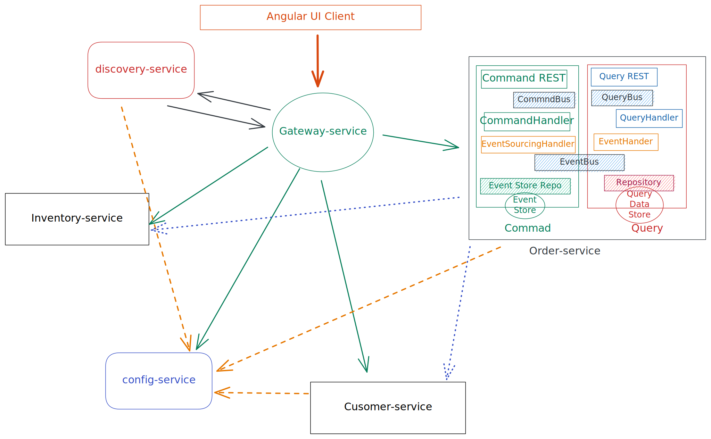

# Établir un diagramme de classe global du projet


# Déployer le serveur AXON Server ou KAFKA Broker

- Le serveur est démaré en tant que Docker container


- Dependences utilisées:


```xml
 <dependency>
    <groupId>org.axonframework</groupId>
    <artifactId>axon-spring-boot-starter</artifactId>
    <version>4.6.1</version>
    <!--			<exclusions>-->
    <!--				<exclusion>-->
    <!--					<groupId>org.axonframework</groupId>-->
    <!--					<artifactId>axon-server-connector</artifactId>-->
    <!--				</exclusion>-->
    <!--			</exclusions>-->
</dependency>
```


# Développer le micro-service Customer-Service
##  1. <a name='Commandside'></a>Command side
###  1.1. <a name='Commands'></a>Commands 

- CreateCustomerCommand
```java
package me.elaamiri.commands.customerCommands;

import lombok.Getter;
import me.elaamiri.commands.BaseCommand;

public class CreateCustomerCommand extends BaseCommand<String> {

    @Getter
    private String nom;
    @Getter
    private String adresse;
    @Getter
    private String email;
    @Getter
    private String telephone;

    public CreateCustomerCommand(String id, String nom, String adresse, String email, String telephone) {
        super(id);
        this.nom = nom;
        this.adresse = adresse;
        this.email = email;
        this.telephone = telephone;
    }
}

```

- UpdateCustomerCommand
```java
package me.elaamiri.commands.customerCommands;

import lombok.Getter;
import me.elaamiri.commands.BaseCommand;

public class UpdateCustomerCommand extends BaseCommand<String> {
    @Getter
    private String nom;
    @Getter
    private String adresse;
    @Getter
    private String email;
    @Getter
    private String telephone;

    public UpdateCustomerCommand(String id, String nom, String adresse, String email, String telephone) {
        super(id);
        this.nom = nom;
        this.adresse = adresse;
        this.email = email;
        this.telephone = telephone;
    }
}

```


- DeleteCustomerCommand
```java
package me.elaamiri.commands.customerCommands;

import me.elaamiri.commands.BaseCommand;

public class DeleteCustomerCommand extends BaseCommand<String> {
    public DeleteCustomerCommand(String id) {
        super(id);
    }
}

```


###  1.2. <a name='Events'></a>Events 

- CustomerCreatedEvent
```java
package me.elaamiri.events.customerEvents;

import lombok.Getter;
import me.elaamiri.events.BaseEvent;

public class CustomerCreatedEvent extends BaseEvent<String> {
    @Getter
    private String nom;
    @Getter
    private String adresse;
    @Getter
    private String email;
    @Getter
    private String telephone;

    public CustomerCreatedEvent(String id, String nom, String adresse, String email, String telephone) {
        super(id);
        this.nom = nom;
        this.adresse = adresse;
        this.email = email;
        this.telephone = telephone;
    }
}

```


- CustomerUpdatedEvent
```java
package me.elaamiri.events.customerEvents;

import lombok.Getter;
import me.elaamiri.events.BaseEvent;

public class CustomerUpdatedEvent extends BaseEvent<String> {
    @Getter
    private String nom;
    @Getter
    private String adresse;
    @Getter
    private String email;
    @Getter
    private String telephone;

    public CustomerUpdatedEvent(String id, String nom, String adresse, String email, String telephone) {
        super(id);
        this.nom = nom;
        this.adresse = adresse;
        this.email = email;
        this.telephone = telephone;
    }
}

```


- CustomerDeletedEvent
```java
package me.elaamiri.events.customerEvents;

import me.elaamiri.events.BaseEvent;

public class CustomerDeletedEvent extends BaseEvent<String> {
    public CustomerDeletedEvent(String id) {
        super(id);
    }
}

```

###  1.3. <a name='Dtos'></a>Dtos

- CreateCustomerRequestDTO
```java
package me.elaamiri.dtos.customerDtos;

import lombok.*;

@Data
@AllArgsConstructor @NoArgsConstructor @Builder
public class CreateCustomerRequestDTO {

    private String nom;

    private String adresse;

    private String email;

    private String telephone;
}

```


- UpdateCustomerRequestDTO
```java
package me.elaamiri.dtos.customerDtos;


@Data
@AllArgsConstructor
@NoArgsConstructor
@Builder
public class UpdateCustomerRequestDTO {
    private String nom;

    private String adresse;

    private String email;

    private String telephone;
}

```

###  1.4. <a name='Aggregate'></a>Aggregate

- CustomerAggregate
```java
package me.elaamiri.customerservice.command.aggregates;

@Aggregate
@Slf4j
public class CustomerAggregate {

    @AggregateIdentifier
    @Getter
    private String id;
    @Getter
    private String nom;
    @Getter
    private String adresse;
    @Getter
    private String email;
    @Getter
    private String telephone;

    public CustomerAggregate() {
    }

    @CommandHandler
    public CustomerAggregate(CreateCustomerCommand command) {
        // validations

        AggregateLifecycle.apply(new CustomerCreatedEvent(
                command.getId(),
                command.getNom(),
                command.getAdresse(),
                command.getEmail(),
                command.getTelephone()
        ));
    }

    @EventSourcingHandler
    public void on(CustomerCreatedEvent event){
        this.id = event.getId();
        this.nom = event.getNom();
        this.adresse = event.getAdresse();
        this.email = event.getEmail();
        this.telephone = event.getTelephone();
    }

    @CommandHandler
    public void handle(UpdateCustomerCommand command){
        // validations
        if(command.getId() == null || command.getId().isBlank()) throw new EntryNotFoundException("Customer Not found");
        AggregateLifecycle.apply(new CustomerUpdatedEvent(
                command.getId(),
                command.getNom(),
                command.getAdresse(),
                command.getEmail(),
                command.getTelephone()
        ));
    }

    @EventSourcingHandler
    public void on(CustomerUpdatedEvent event){
        this.id = event.getId();
        this.nom = event.getNom();
        this.adresse = event.getAdresse();
        this.email = event.getEmail();
        this.telephone = event.getTelephone();
    }


    @CommandHandler
    public void handle(DeleteCustomerCommand command){
        if(command.getId() == null || command.getId().isBlank()) throw new EntryNotFoundException("Customer Not found");
        AggregateLifecycle.apply(new CustomerDeletedEvent(
                command.getId()
        ));
    }

    @EventSourcingHandler
    public void on(CustomerDeletedEvent event){
        log.warn("Deleting Customer: "+ event.getId());
    }
}

```

###  1.5. <a name='Controller'></a>Controller
- CustomerCommandController
```java
package me.elaamiri.customerservice.command.controllers;

@RestController
@AllArgsConstructor
@RequestMapping("/commands/customer")
public class CustomerCommandController {
    private CommandGateway commandGateway;

    @PostMapping("/create")
    public CompletableFuture<String> create(@RequestBody CreateCustomerRequestDTO customerRequestDTO){
        CompletableFuture<String> response = commandGateway.send(
                new CreateCustomerCommand(
                        UUID.randomUUID().toString(),
                        customerRequestDTO.getNom(),
                        customerRequestDTO.getAdresse(),
                        customerRequestDTO.getEmail(),
                        customerRequestDTO.getTelephone()
                )
        );

        return  response;

    }

    @PutMapping("/update/{id}")
    public CompletableFuture<String> update(@RequestBody UpdateCustomerRequestDTO customerRequestDTO, @PathVariable String id){
        CompletableFuture<String> response = commandGateway.send(
                new UpdateCustomerCommand(
                        id,
                        customerRequestDTO.getNom(),
                        customerRequestDTO.getAdresse(),
                        customerRequestDTO.getEmail(),
                        customerRequestDTO.getTelephone()
                )
        );

        return  response;

    }

    @DeleteMapping("/delete/{id}")
    public CompletableFuture<String> delete( @PathVariable String id){
        CompletableFuture<String> response = commandGateway.send(
                new DeleteCustomerCommand(
                        id
                )
        );

        return  response;

    }
}

```

###  1.6. <a name='Tests'></a>Tests

- Our service in Axon 

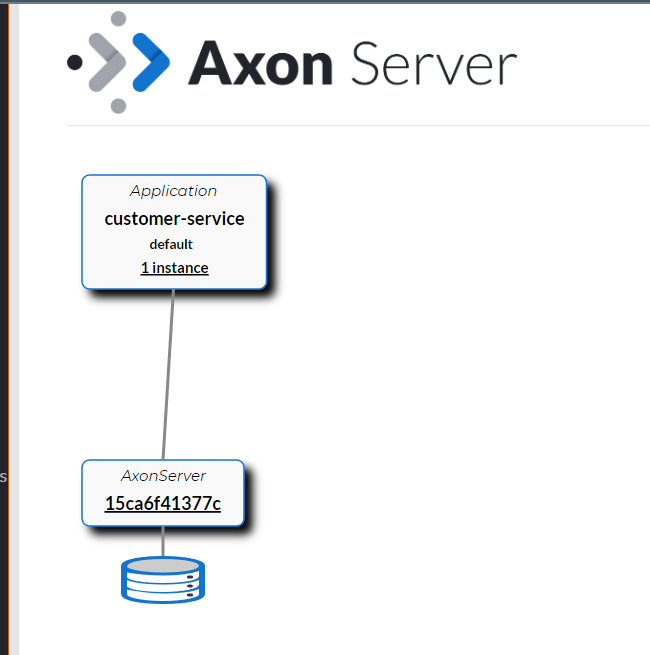

- Create Customer 

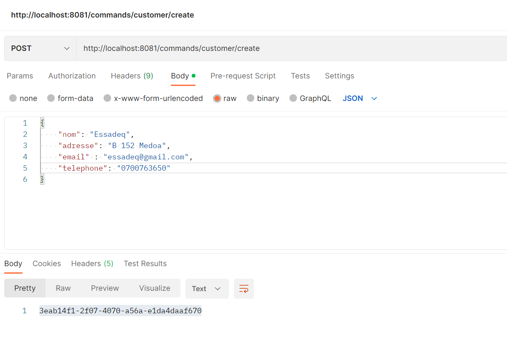

- Update Customer


- Delete Customer 

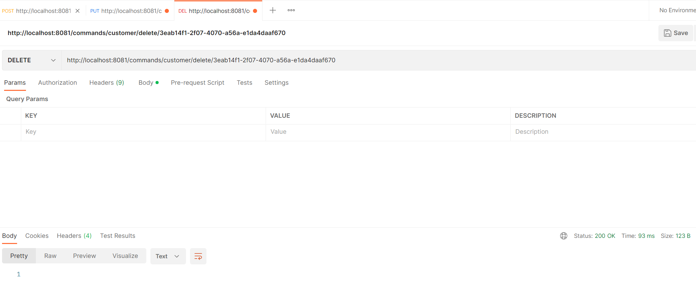

- All 3 events


##  2. <a name='Queryside'></a>Query side 

###  2.1. <a name='Queries'></a>Queries 


- GetAllCustomersQuery

```java
package me.elaamiri.queries.customerQueries;

public class GetAllCustomersQuery {
}

```

- GetCustomerByIdQuery

```java
package me.elaamiri.queries.customerQueries;

import lombok.Getter;

public class GetCustomerByIdQuery {

    @Getter
    private String id;

    public GetCustomerByIdQuery(String id) {
        this.id = id;
    }
}

```

###  2.2. <a name='Entities'></a>Entities 

- Customer

```java
package me.elaamiri.customerservice.query.entities;

@Entity
@Data
@AllArgsConstructor @NoArgsConstructor @Builder
public class Customer {
    @Id
    private String id;

    private String nom;

    private String adresse;

    private String email;

    private String telephone;
}

```

###  2.3. <a name='Repositories'></a>Repositories 

- CustomerRepository

```java
package me.elaamiri.customerservice.query.repositories;

public interface CustomerRepository extends JpaRepository<Customer, String> {
}

```

###  2.4. <a name='EventhandlerService'></a>Eventhandler Service

- CustomerEventHandlerService

```java
package me.elaamiri.customerservice.query.services;

@Service
@Slf4j
@AllArgsConstructor
public class CustomerEventHandlerService {
    private CustomerRepository customerRepository;

    @EventHandler
    public void on(CustomerCreatedEvent event){
        Customer customer = Customer.builder()
                .id(event.getId())
                .adresse(event.getAdresse())
                .email(event.getEmail())
                .telephone(event.getTelephone())
                .nom(event.getNom())
                .build();
        customerRepository.save(customer);
    }

    @EventHandler
    public void on(CustomerUpdatedEvent event){
        Customer customer = customerRepository.findById(event.getId())
                .orElseThrow(()-> new EntryNotFoundException("Customer Not Found"));
        customer.setNom(event.getNom());
        customer.setAdresse(event.getAdresse());
        customer.setEmail(event.getEmail());
        customer.setTelephone(event.getTelephone());
//        customer.setId(event.getId());
        customerRepository.save(customer);

    }

    @EventHandler
    public void on(CustomerDeletedEvent event){
        Customer customer = customerRepository.findById(event.getId())
                .orElseThrow(()-> new EntryNotFoundException("Customer Not Found"));
        customerRepository.delete(customer);
    }

}

```

###  2.5. <a name='QueryhandlerService'></a>Queryhandler Service 

- CustomerQueryHandler
```java
package me.elaamiri.customerservice.query.services;

@Service
@Slf4j
@AllArgsConstructor
public class CustomerQueryHandler {
    private CustomerRepository customerRepository;

    @QueryHandler
    public List<Customer> handle(GetAllCustomersQuery query){
        return customerRepository.findAll();
    }

    @QueryHandler
    public Customer handle(GetCustomerByIdQuery query){
        return customerRepository.findById(query.getId())
                .orElseThrow(()-> new EntryNotFoundException("Customer Not Found"));
    }
}

```

###  2.6. <a name='Controllers'></a>Controllers

- CustomerQueryController
```java
package me.elaamiri.customerservice.query.controllers;

@RestController
@AllArgsConstructor
@RequestMapping("/query/customers")
public class CustomerQueryController {

    private QueryGateway queryGateway;

    @GetMapping("")
    public List<Customer> getAllCustomers(){
        List<Customer> customers = queryGateway
                .query(new GetAllCustomersQuery(), ResponseTypes.multipleInstancesOf(Customer.class)).join();
        return customers;
    }

    @GetMapping("/{id}")
    public Customer getCustomerById(@PathVariable String id){
        Customer customer = queryGateway
                .query(new GetCustomerByIdQuery(id), ResponseTypes.instanceOf(Customer.class)).join();
        return customer;
    }
}


```

###  2.7. <a name='Tests-1'></a>Tests 

- Get all customers 

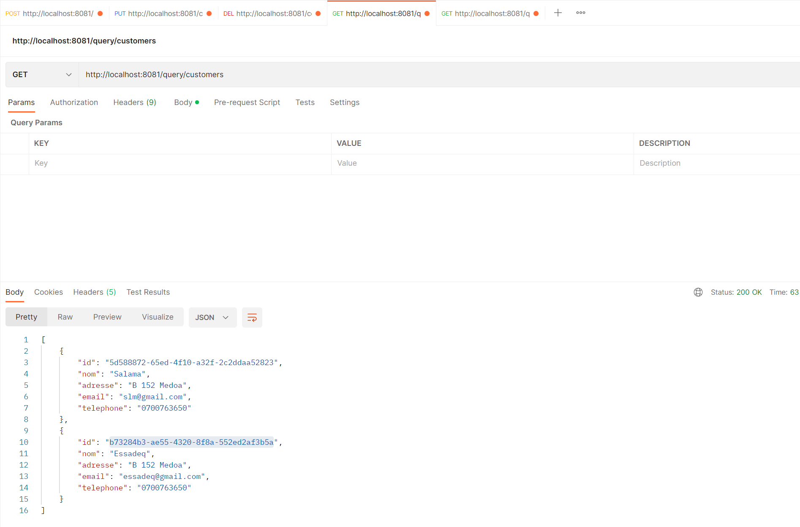

- Get One by ID 


- In the Database

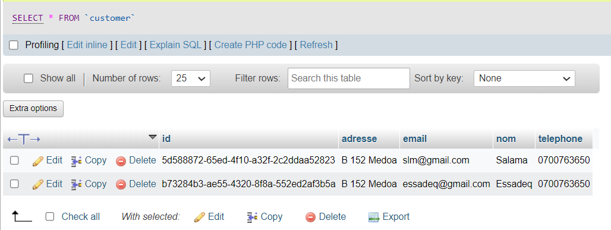


# Développer le micro-service Inventory-Service

##  3. <a name='Commandside-1'></a>Command side 

###  3.1. <a name='Commands-1'></a>Commands

- CreateProductCommand

```java
package me.elaamiri.commands.productCommands;

public class CreateProductCommand extends BaseCommand<String> {

    @Getter
    private String nom;
    @Getter
    private double prix;
    @Getter
    private int quentiteStocke;
    @Getter
    private ProductStatus productStatus;

    @Getter
    private String categoryId;

    public CreateProductCommand(String id, String nom, double prix, int quentiteStocke, ProductStatus productStatus, String categoryId) {
        super(id);
        this.nom = nom;
        this.prix = prix;
        this.quentiteStocke = quentiteStocke;
        this.productStatus = productStatus;
        this.categoryId = categoryId;
    }
}


```
- UpdateProductCommand

```java
package me.elaamiri.commands.productCommands;

public class UpdateProductCommand extends BaseCommand<String> {
    @Getter
    private String nom;
    @Getter
    private double prix;
    @Getter
    private int quentiteStocke;
    @Getter
    private ProductStatus productStatus;

    @Getter
    private String categoryId;

    public UpdateProductCommand(String id, String nom, double prix, int quentiteStocke, ProductStatus productStatus, String categoryId) {
        super(id);
        this.nom = nom;
        this.prix = prix;
        this.quentiteStocke = quentiteStocke;
        this.productStatus = productStatus;
        this.categoryId = categoryId;
    }
}

```

- DeleteProductCommand

```java
package me.elaamiri.commands.productCommands;

public class DeleteProductCommand extends BaseCommand<String> {
    public DeleteProductCommand(String id) {
        super(id);
    }
}

```

- CreateCategoryCommand

```java
package me.elaamiri.commands.categoryCommands;

public class CreateCategoryCommand extends BaseCommand<String> {

    @Getter
    private String nom;

    @Getter
    private String description;

    public CreateCategoryCommand(String id, String nom, String description) {
        super(id);
        this.nom = nom;
        this.description = description;
    }
}

```

- UpdateCategoryCommand

```java
package me.elaamiri.commands.categoryCommands;

public class UpdateCategoryCommand extends BaseCommand<String> {
    @Getter
    private String nom;

    @Getter
    private String description;

    public UpdateCategoryCommand(String id, String nom, String description) {
        super(id);
        this.nom = nom;
        this.description = description;
    }
}

```

- DeleteCategoryCommand

```java
package me.elaamiri.commands.categoryCommands;


public class DeleteCategoryCommand extends BaseCommand<String> {
    public DeleteCategoryCommand(String id) {
        super(id);
    }
}

```

###  3.2. <a name='Events-1'></a>Events 

- ProductCreatedEvent

```java
package me.elaamiri.events.productEvents;

public class ProductCreatedEvent extends BaseEvent<String> {
    @Getter
    private String nom;
    @Getter
    private double prix;
    @Getter
    private int quentiteStocke;
    @Getter
    private ProductStatus productStatus;

    @Getter
    private String categoryId;

    public ProductCreatedEvent(String id, String nom, double prix, int quentiteStocke, ProductStatus productStatus, String categoryId) {
        super(id);
        this.nom = nom;
        this.prix = prix;
        this.quentiteStocke = quentiteStocke;
        this.productStatus = productStatus;
        this.categoryId = categoryId;
    }
}

```

- ProductUpdatedEvent

```java
package me.elaamiri.events.productEvents;

public class ProductUpdatedEvent extends BaseEvent<String> {
    @Getter
    private String nom;
    @Getter
    private double prix;
    @Getter
    private int quentiteStocke;
    @Getter
    private ProductStatus productStatus;

    @Getter
    private String categoryId;

    public ProductUpdatedEvent(String id, String nom, double prix, int quentiteStocke, ProductStatus productStatus, String categoryId) {
        super(id);
        this.nom = nom;
        this.prix = prix;
        this.quentiteStocke = quentiteStocke;
        this.productStatus = productStatus;
        this.categoryId = categoryId;
    }
}

```

- ProductDeletedEvent

```java
package me.elaamiri.events.productEvents;

public class ProductDeletedEvent extends BaseEvent<String> {
    public ProductDeletedEvent(String id) {
        super(id);
    }
}

```

- CategoryCreatedEvent

```java
package me.elaamiri.events.categoryEvents;

public class CategoryCreatedEvent extends BaseEvent<String> {
    @Getter
    private String nom;

    @Getter
    private String description;

    public CategoryCreatedEvent(String id, String nom, String description) {
        super(id);
        this.nom = nom;
        this.description = description;
    }
}

```

- CategoryUpdatedEvent

```java
package me.elaamiri.events.categoryEvents;

public class CategoryUpdatedEvent extends BaseEvent<String> {
    @Getter
    private String nom;

    @Getter
    private String description;

    public CategoryUpdatedEvent(String id, String nom, String description) {
        super(id);
        this.nom = nom;
        this.description = description;
    }
}

```


- CategoryDeletedEvent

```java
package me.elaamiri.events.categoryEvents;

import me.elaamiri.events.BaseEvent;

public class CategoryDeletedEvent extends BaseEvent<String> {
    public CategoryDeletedEvent(String id) {
        super(id);
    }
}

```

###  3.3. <a name='Aggregates'></a>Aggregates 

- ProductAggregate

```java
package me.elaamiri.inventoryservice.command.aggregates;

@Aggregate @Slf4j
public class ProductAggregate {
    @AggregateIdentifier
    @Getter
    private  String id;
    @Getter
    private String nom;
    @Getter
    private double prix;
    @Getter
    private int quentiteStocke;
    @Getter
    private ProductStatus productStatus;

    @Getter
    private String categoryId;

    public ProductAggregate() {
    }

    @CommandHandler
    public ProductAggregate(CreateProductCommand command) {
        // validations
        AggregateLifecycle.apply(new ProductCreatedEvent(
                command.getId(),
                command.getNom(),
                command.getPrix(),
                command.getQuentiteStocke(),
                command.getProductStatus(),
                command.getCategoryId()
        ));
    }

    @EventSourcingHandler

    public void on(ProductCreatedEvent event){
        this.id = event.getId();
        this.productStatus = event.getProductStatus();
        this.nom = event.getNom();
        this.prix = event.getPrix();
        this.quentiteStocke = event.getQuentiteStocke();
        this.categoryId = event.getCategoryId();
    }


    @CommandHandler
    public void handle(UpdateProductCommand command){

        if(command.getId() == null || command.getId().isBlank()) throw new EntryNotFoundException("Product Not Found.");
        // validations
        AggregateLifecycle.apply(new ProductUpdatedEvent(
                command.getId(),
                command.getNom(),
                command.getPrix(),
                command.getQuentiteStocke(),
                command.getProductStatus(),
                command.getCategoryId()
        ));
    }

    @EventSourcingHandler

    public void on(ProductUpdatedEvent event){
        this.id = event.getId();
        this.productStatus = event.getProductStatus();
        this.nom = event.getNom();
        this.prix = event.getPrix();
        this.quentiteStocke = event.getQuentiteStocke();
        this.categoryId = event.getCategoryId();
    }

    @CommandHandler
    public void handle(DeleteProductCommand command){
        if(command.getId() == null || command.getId().isBlank()) throw new EntryNotFoundException("Product Not Found.");
        // validations
        AggregateLifecycle.apply(new ProductDeletedEvent(
                command.getId()));
    }

    @EventSourcingHandler
    public void on(ProductDeletedEvent event){
        log.warn("Deleting Product: "+ event.getId());
    }


}

```

- CategoryAggregate

```java
package me.elaamiri.inventoryservice.command.aggregates;

@Aggregate @Slf4j
public class CategoryAggregate {

    @AggregateIdentifier
    @Getter
    private String id;
    @Getter
    private String nom;

    @Getter
    private String description;

    public CategoryAggregate() {
    }

    @CommandHandler
    public CategoryAggregate(CreateCategoryCommand command) {
        // validations
        AggregateLifecycle.apply(new CategoryCreatedEvent(
                command.getId(),
                command.getNom(),
                command.getDescription()
        ));
    }

    @EventSourcingHandler

    public void on(CategoryCreatedEvent event){
        this.id = event.getId();
        this.nom = event.getNom();
        this.description=event.getDescription();
    }


    @CommandHandler
    public void handle(UpdateCategoryCommand command){

        if(command.getId() == null || command.getId().isBlank()) throw new EntryNotFoundException("Category Not Found.");
        // validations
        AggregateLifecycle.apply(new CategoryUpdatedEvent(
                command.getId(),
                command.getNom(),
                command.getDescription()
        ));
    }

    @EventSourcingHandler

    public void on(CategoryUpdatedEvent event){
        this.id = event.getId();
        this.description = event.getDescription();
        this.nom = event.getNom();

    }

    @CommandHandler
    public void handle(DeleteCategoryCommand command){
        if(command.getId() == null || command.getId().isBlank()) throw new EntryNotFoundException("Category Not Found.");
        // validations
        AggregateLifecycle.apply(new CategoryDeletedEvent(
                command.getId()));
    }

    @EventSourcingHandler
    public void on(CategoryDeletedEvent event){
        log.warn("Deleting Category: "+ event.getId());
    }

}

```

###  3.4. <a name='Controllers-1'></a>Controllers

- ProductCommandController

```java
package me.elaamiri.inventoryservice.command.controllers;

@RestController
@AllArgsConstructor
@RequestMapping(path = "/commands/product")
public class ProductCommandController {
    private CommandGateway commandGateway;

    @PostMapping("/create")
    public CompletableFuture<String> createProduct(@RequestBody CreateProductRequestDTO createProductRequestDTO){
        CompletableFuture<String> response = commandGateway.send(new CreateProductCommand(
                UUID.randomUUID().toString(),
                createProductRequestDTO.getNom(),
                createProductRequestDTO.getPrix(),
                createProductRequestDTO.getQuentiteStocke(),
                createProductRequestDTO.getProductStatus(),
                createProductRequestDTO.getCategoryId()
        ));
        return  response;
    }

    @PutMapping("/update/{id}")
    public CompletableFuture<String> updateProduct(@RequestBody UpdateProductRequestDTO updateProductRequestDTO, @PathVariable String id){
        CompletableFuture<String> response = commandGateway.send(new UpdateProductCommand(
                id, // entered ID
                updateProductRequestDTO.getNom(),
                updateProductRequestDTO.getPrix(),
                updateProductRequestDTO.getQuentiteStocke(),
                updateProductRequestDTO.getProductStatus(),
                updateProductRequestDTO.getCategoryId()
        ));
        return  response;
    }

    @DeleteMapping("/delete/{id}")
    public CompletableFuture<String> deleteProduct(@PathVariable String id){
        CompletableFuture<String> response = commandGateway.send(new DeleteProductCommand(
                id// entered ID
        ));
        return  response;
    }


    //@ExceptionHandler(Exception.class)
    public ResponseEntity<String> exceptionHandler(Exception exception){
        ResponseEntity<String> responseEntity = new ResponseEntity<>(
                exception.getMessage(), HttpStatus.INTERNAL_SERVER_ERROR
        );

        return responseEntity;
    }
}

```

- CategoryCommandController

```java
package me.elaamiri.inventoryservice.command.controllers;

@RestController
@AllArgsConstructor
@RequestMapping(path = "/commands/category")
public class CategoryCommandController {
    private CommandGateway commandGateway;

    @PostMapping("/create")
    public CompletableFuture<String> createCategory(@RequestBody CreateCategoryRequestDTO createCategoryRequestDTO){
        CompletableFuture<String> response = commandGateway.send(new CreateCategoryCommand(
                UUID.randomUUID().toString(),
                createCategoryRequestDTO.getNom(),
                createCategoryRequestDTO.getDescription()
        ));
        return  response;
    }

    @PutMapping("/update/{id}")
    public CompletableFuture<String> updateCategory(@RequestBody UpdateCategoryRequestDTO updateCategoryRequestDTO, @PathVariable String id){
        CompletableFuture<String> response = commandGateway.send(new UpdateCategoryCommand(
                id, // entered ID
                updateCategoryRequestDTO.getNom(),
                updateCategoryRequestDTO.getDescription()));
        return  response;
    }

    @DeleteMapping("/delete/{id}")
    public CompletableFuture<String> deleteCategory(@PathVariable String id){
        CompletableFuture<String> response = commandGateway.send(new DeleteCategoryCommand(
                id// entered ID
        ));
        return  response;
    }


    //@ExceptionHandler(Exception.class)
    public ResponseEntity<String> exceptionHandler(Exception exception){
        ResponseEntity<String> responseEntity = new ResponseEntity<>(
                exception.getMessage(), HttpStatus.INTERNAL_SERVER_ERROR
        );

        return responseEntity;
    }
}

```

###  3.5. <a name='tests'></a>tests

- Creation Category 

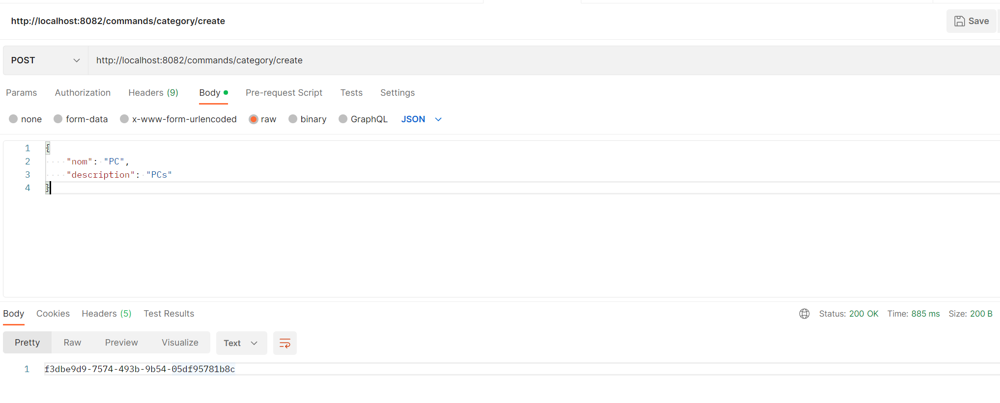

- Updating Category

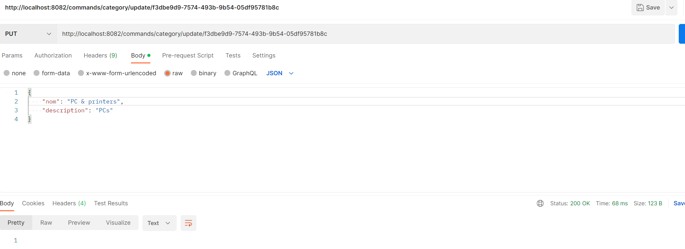

- Creating Product

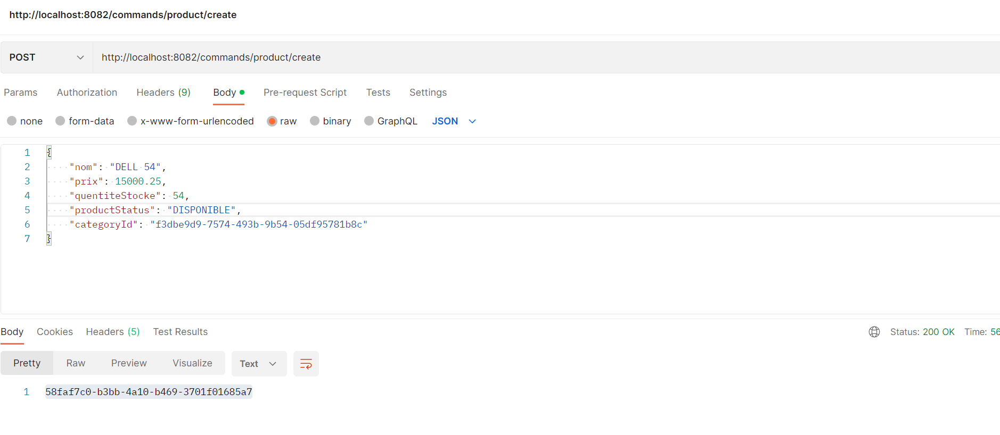

- Updating Product

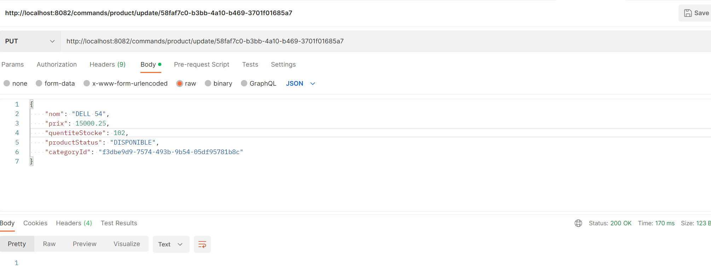

- Deleting Product


- Dans le serveur 

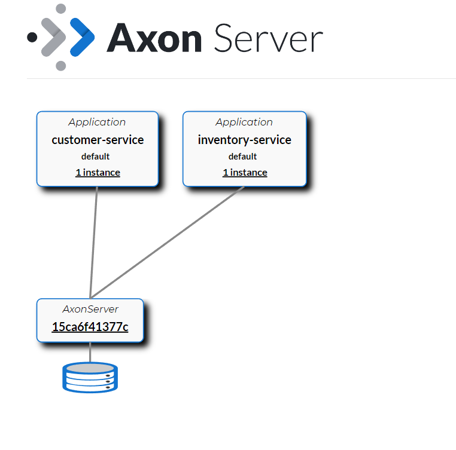

- Les evenements dans Axon

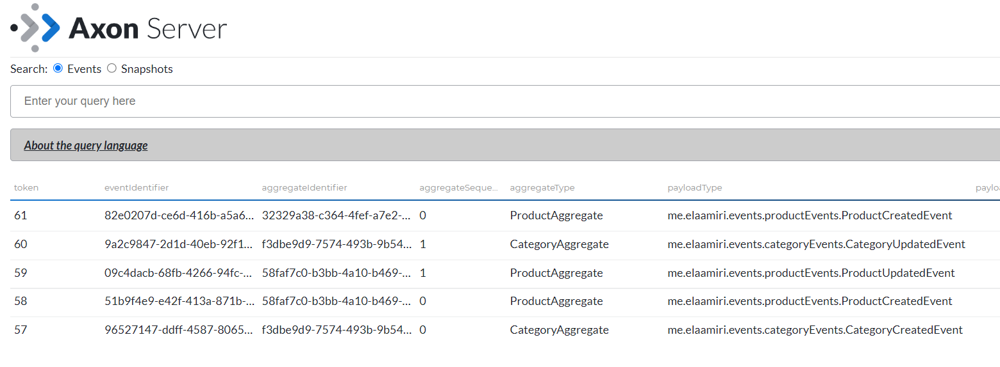

##  4. <a name='Queryside-1'></a>Query side 

###  4.1. <a name='Queries-1'></a>Queries 

- GetAllProductsQuery

```java
package me.elaamiri.queries.productQueries;

public class GetAllProductsQuery {
}

```

- GetProductByIdQuery

```java
package me.elaamiri.queries.productQueries;

import lombok.Getter;

public class GetProductByIdQuery {

    @Getter
    private String id;

    public GetProductByIdQuery(String id) {
        this.id = id;
    }
}

```

- GetAllCategoriesQuery

```java
package me.elaamiri.queries.categoryQueries;

public class GetAllCategoriesQuery {
}

```

- GetCategoryByIdQuery

```java
package me.elaamiri.queries.categoryQueries;

public class GetCategoryByIdQuery {

    @Getter
    private String id;

    public GetCategoryByIdQuery(String id) {
        this.id = id;
    }
}

```

###  4.2. <a name='Entities-1'></a>Entities 
- 

```java
package me.elaamiri.inventoryservice.query.entities;

@Entity
@Data @AllArgsConstructor @NoArgsConstructor
public class Product {

    @Id
    private String id;

    private String nom;

    private double prix;

    private int quentiteStocke;

    private ProductStatus productStatus;


    private String categoryId;
     @ManyToOne
    private Category category;
}

```

- Category

```java
package me.elaamiri.inventoryservice.query.entities;

@Entity
@Data @AllArgsConstructor @NoArgsConstructor
public class Category {

    @Id
    private String id;

    private String nom;

    private String description;

    
    @OneToMany(mappedBy = "category")
    @JsonProperty(access = JsonProperty.Access.WRITE_ONLY)
    private Collection<Product> products;
}

```

###  4.3. <a name='Repositories-1'></a>Repositories

- ProductRepository

```java
package me.elaamiri.inventoryservice.query.repositories;

public interface ProductRepository extends JpaRepository<Product, String> {
}

```

- CategoryRepository

```java
package me.elaamiri.inventoryservice.query.repositories;

public interface CategoryRepository extends JpaRepository<Category, String> {
}

```

###  4.4. <a name='EventHandlerServices'></a>EventHandler Services

- ProductEventHandlerService

```java
package me.elaamiri.inventoryservice.query.services;

@Service
@Slf4j
@AllArgsConstructor
public class ProductEventHandlerService {

    private ProductRepository productRepository;
    private CategoryRepository categoryRepository;

    @EventHandler
    public void on(ProductCreatedEvent event){
        Product product = Product.builder()
                .id(event.getId())
                .nom(event.getNom())
                .categoryId(event.getCategoryId())
                .productStatus(event.getProductStatus())
                .prix(event.getPrix())
                .quentiteStocke(event.getQuentiteStocke())
                .build();
        // find Category
        Category category = categoryRepository.findById(event.getCategoryId()).orElseThrow(()-> new EntryNotFoundException("Category not found"));
        product.setCategory(category);
        productRepository.save(product);
    }

    @EventHandler
    public void on(ProductUpdatedEvent event){
        Product product = productRepository.findById(event.getId())
                .orElseThrow(()-> new EntryNotFoundException("Product Not Found"));
        product.setNom(event.getNom());
        product.setProductStatus(event.getProductStatus());
        product.setCategoryId(event.getCategoryId());
        product.setPrix(event.getPrix());
        product.setQuentiteStocke(event.getQuentiteStocke());
        
        Category category = categoryRepository.findById(event.getCategoryId()).orElseThrow(()-> new EntryNotFoundException("Category not found"));
        product.setCategory(category);
//        product.setId(event.getId());
        productRepository.save(product);

    }

    @EventHandler
    public void on(ProductDeletedEvent event){
        Product product = productRepository.findById(event.getId())
                .orElseThrow(()-> new EntryNotFoundException("Product Not Found"));
        productRepository.delete(product);
    }
}

```

- 

```java

```

###  4.5. <a name='QueryHandlerServices'></a>QueryHandler Services 

- 

```java

```

- 

```java

```

###  4.6. <a name='QueryControllers'></a>Query Controllers 

- 

```java

```

- 

```java

```

###  4.7. <a name='Tests-1'></a>Tests


# Développer le micro-service Order-Service

# Mettre en place les services techniques de l’architecture micro-service (Gateway, Eureka ou Consul Discovery service, Config Service)

##  5. <a name='Discveryservice'></a>Discvery service 

- `pom.xml`

```xml
 <dependency>
    <groupId>org.springframework.cloud</groupId>
    <artifactId>spring-cloud-starter-netflix-eureka-server</artifactId>
</dependency>
``` 

- properties 

```poperties
server.port=8761 # it is the default port used by the services to register
# do not register itself as a client
eureka.client.fetch-registry=false
# Does not register itself in the service registry
eureka.client.register-with-eureka=false
```

- Application 

```java

@EnableEurekaServer
@SpringBootApplication
public class EurekaDiscoveryServiceApplication {

    public static void main(String[] args) {
        SpringApplication.run(EurekaDiscoveryServiceApplication.class, args);
    }

}

```

##  6. <a name='Gatewayservice'></a>Gateway service 

- Dependency 

```xml
<dependencies>
    <dependency>
        <groupId>org.springframework.cloud</groupId>
        <artifactId>spring-cloud-starter-gateway</artifactId>
    </dependency>
    <dependency>
        <groupId>org.springframework.cloud</groupId>
        <artifactId>spring-cloud-starter-netflix-eureka-client</artifactId>
    </dependency>
    ...
</dependencies>

```

- Properties 

```properties 
server.port=8888
spring.application.name=GATEWAY-SERVICE
## the gateway also should be registred in the discovery server
eureka.client.register-with-eureka=true
eureka.instance.prefer-ip-address=true
```

- Configuration

```java
package me.elaamiri.gatewayservice;

@Configuration
public class GatewayConfig {

    @Bean
    DiscoveryClientRouteDefinitionLocator discoveryClientRouteDefinitionLocator(ReactiveDiscoveryClient reactiveDiscoveryClient,
                                                                                DiscoveryLocatorProperties discoveryLocatorProperties){
        return new DiscoveryClientRouteDefinitionLocator(reactiveDiscoveryClient, discoveryLocatorProperties);
    }
}

```


# Développer un micro-service qui permet faire du Real time Data Analytics en utilisant Kafka Streams (Nombre et total des commandes sur une fenêtre temporelle de 5 secondes)

# Développer votre application Frontend avec Angular ou React

#  Sécuriser votre système avec un système de d’authentification OAuth2, OIDC avec Keycloak ou un service d’authentification basé sur Spring Security et JWT

# Écrire un script docker-compose.yml pour le déploiement de ce système distribué dans des
conteneurs docker.