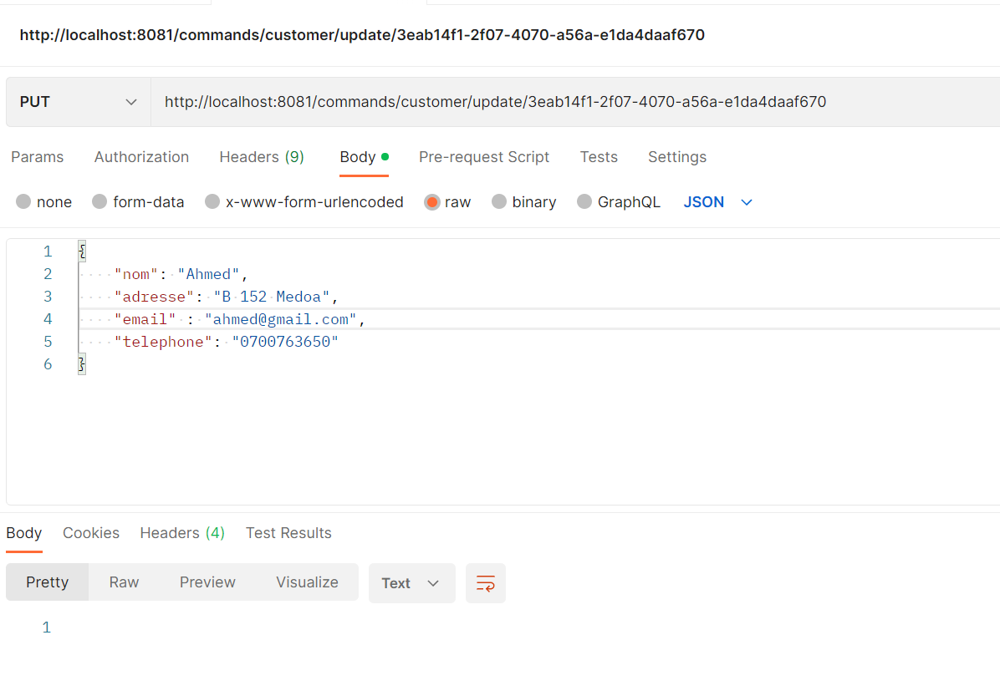
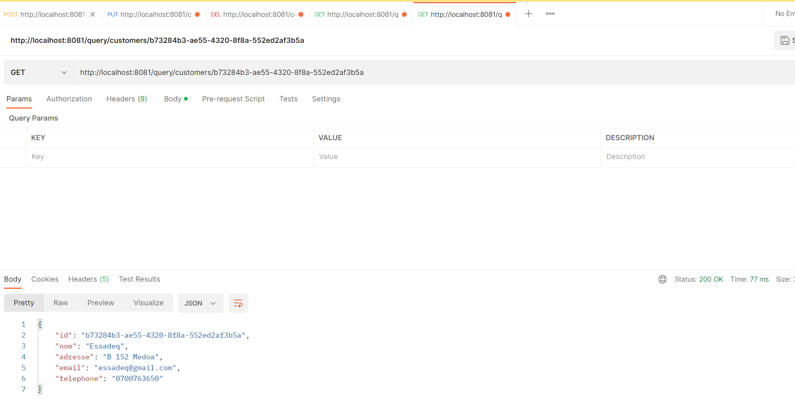

# examen-microservices-distributed-systems

|ENSET-M|II-BDCC 2|EL AAMIRI Essadeq|
|---|---|---|

Développer les fonctionnalités qui vous semblent les plus importantes pour ce projet et rendre un
rapport et le code source de l’application répondant aux questions suivantes :


# Établir une architecture technique du projet


# Établir un diagramme de classe global du projet


# Déployer le serveur AXON Server ou KAFKA Broker

- Le serveur est démaré en tant que Docker container


- Dependences utilisées:


```xml
 <dependency>
    <groupId>org.axonframework</groupId>
    <artifactId>axon-spring-boot-starter</artifactId>
    <version>4.6.1</version>
    <!--			<exclusions>-->
    <!--				<exclusion>-->
    <!--					<groupId>org.axonframework</groupId>-->
    <!--					<artifactId>axon-server-connector</artifactId>-->
    <!--				</exclusion>-->
    <!--			</exclusions>-->
</dependency>
```


# Développer le micro-service Customer-Service
## Command side
### Commands 

- CreateCustomerCommand
```java
package me.elaamiri.commands.customerCommands;

import lombok.Getter;
import me.elaamiri.commands.BaseCommand;

public class CreateCustomerCommand extends BaseCommand<String> {

    @Getter
    private String nom;
    @Getter
    private String adresse;
    @Getter
    private String email;
    @Getter
    private String telephone;

    public CreateCustomerCommand(String id, String nom, String adresse, String email, String telephone) {
        super(id);
        this.nom = nom;
        this.adresse = adresse;
        this.email = email;
        this.telephone = telephone;
    }
}

```

- UpdateCustomerCommand
```java
package me.elaamiri.commands.customerCommands;

import lombok.Getter;
import me.elaamiri.commands.BaseCommand;

public class UpdateCustomerCommand extends BaseCommand<String> {
    @Getter
    private String nom;
    @Getter
    private String adresse;
    @Getter
    private String email;
    @Getter
    private String telephone;

    public UpdateCustomerCommand(String id, String nom, String adresse, String email, String telephone) {
        super(id);
        this.nom = nom;
        this.adresse = adresse;
        this.email = email;
        this.telephone = telephone;
    }
}

```


- DeleteCustomerCommand
```java
package me.elaamiri.commands.customerCommands;

import me.elaamiri.commands.BaseCommand;

public class DeleteCustomerCommand extends BaseCommand<String> {
    public DeleteCustomerCommand(String id) {
        super(id);
    }
}

```


### Events 

- CustomerCreatedEvent
```java
package me.elaamiri.events.customerEvents;

import lombok.Getter;
import me.elaamiri.events.BaseEvent;

public class CustomerCreatedEvent extends BaseEvent<String> {
    @Getter
    private String nom;
    @Getter
    private String adresse;
    @Getter
    private String email;
    @Getter
    private String telephone;

    public CustomerCreatedEvent(String id, String nom, String adresse, String email, String telephone) {
        super(id);
        this.nom = nom;
        this.adresse = adresse;
        this.email = email;
        this.telephone = telephone;
    }
}

```


- CustomerUpdatedEvent
```java
package me.elaamiri.events.customerEvents;

import lombok.Getter;
import me.elaamiri.events.BaseEvent;

public class CustomerUpdatedEvent extends BaseEvent<String> {
    @Getter
    private String nom;
    @Getter
    private String adresse;
    @Getter
    private String email;
    @Getter
    private String telephone;

    public CustomerUpdatedEvent(String id, String nom, String adresse, String email, String telephone) {
        super(id);
        this.nom = nom;
        this.adresse = adresse;
        this.email = email;
        this.telephone = telephone;
    }
}

```


- CustomerDeletedEvent
```java
package me.elaamiri.events.customerEvents;

import me.elaamiri.events.BaseEvent;

public class CustomerDeletedEvent extends BaseEvent<String> {
    public CustomerDeletedEvent(String id) {
        super(id);
    }
}

```

### Dtos

- CreateCustomerRequestDTO
```java
package me.elaamiri.dtos.customerDtos;

import lombok.*;

@Data
@AllArgsConstructor @NoArgsConstructor @Builder
public class CreateCustomerRequestDTO {

    private String nom;

    private String adresse;

    private String email;

    private String telephone;
}

```


- UpdateCustomerRequestDTO
```java
package me.elaamiri.dtos.customerDtos;


@Data
@AllArgsConstructor
@NoArgsConstructor
@Builder
public class UpdateCustomerRequestDTO {
    private String nom;

    private String adresse;

    private String email;

    private String telephone;
}

```

### Aggregate

- CustomerAggregate
```java
package me.elaamiri.customerservice.command.aggregates;

@Aggregate
@Slf4j
public class CustomerAggregate {

    @AggregateIdentifier
    @Getter
    private String id;
    @Getter
    private String nom;
    @Getter
    private String adresse;
    @Getter
    private String email;
    @Getter
    private String telephone;

    public CustomerAggregate() {
    }

    @CommandHandler
    public CustomerAggregate(CreateCustomerCommand command) {
        // validations

        AggregateLifecycle.apply(new CustomerCreatedEvent(
                command.getId(),
                command.getNom(),
                command.getAdresse(),
                command.getEmail(),
                command.getTelephone()
        ));
    }

    @EventSourcingHandler
    public void on(CustomerCreatedEvent event){
        this.id = event.getId();
        this.nom = event.getNom();
        this.adresse = event.getAdresse();
        this.email = event.getEmail();
        this.telephone = event.getTelephone();
    }

    @CommandHandler
    public void handle(UpdateCustomerCommand command){
        // validations
        if(command.getId() == null || command.getId().isBlank()) throw new EntryNotFoundException("Customer Not found");
        AggregateLifecycle.apply(new CustomerUpdatedEvent(
                command.getId(),
                command.getNom(),
                command.getAdresse(),
                command.getEmail(),
                command.getTelephone()
        ));
    }

    @EventSourcingHandler
    public void on(CustomerUpdatedEvent event){
        this.id = event.getId();
        this.nom = event.getNom();
        this.adresse = event.getAdresse();
        this.email = event.getEmail();
        this.telephone = event.getTelephone();
    }


    @CommandHandler
    public void handle(DeleteCustomerCommand command){
        if(command.getId() == null || command.getId().isBlank()) throw new EntryNotFoundException("Customer Not found");
        AggregateLifecycle.apply(new CustomerDeletedEvent(
                command.getId()
        ));
    }

    @EventSourcingHandler
    public void on(CustomerDeletedEvent event){
        log.warn("Deleting Customer: "+ event.getId());
    }
}

```

### Controller
- CustomerCommandController
```java
package me.elaamiri.customerservice.command.controllers;

@RestController
@AllArgsConstructor
@RequestMapping("/commands/customer")
public class CustomerCommandController {
    private CommandGateway commandGateway;

    @PostMapping("/create")
    public CompletableFuture<String> create(@RequestBody CreateCustomerRequestDTO customerRequestDTO){
        CompletableFuture<String> response = commandGateway.send(
                new CreateCustomerCommand(
                        UUID.randomUUID().toString(),
                        customerRequestDTO.getNom(),
                        customerRequestDTO.getAdresse(),
                        customerRequestDTO.getEmail(),
                        customerRequestDTO.getTelephone()
                )
        );

        return  response;

    }

    @PutMapping("/update/{id}")
    public CompletableFuture<String> update(@RequestBody UpdateCustomerRequestDTO customerRequestDTO, @PathVariable String id){
        CompletableFuture<String> response = commandGateway.send(
                new UpdateCustomerCommand(
                        id,
                        customerRequestDTO.getNom(),
                        customerRequestDTO.getAdresse(),
                        customerRequestDTO.getEmail(),
                        customerRequestDTO.getTelephone()
                )
        );

        return  response;

    }

    @DeleteMapping("/delete/{id}")
    public CompletableFuture<String> delete( @PathVariable String id){
        CompletableFuture<String> response = commandGateway.send(
                new DeleteCustomerCommand(
                        id
                )
        );

        return  response;

    }
}

```

### Tests

- Our service in Axon 


- Create Customer 


- Update Customer



- Delete Customer 


- All 3 events


## Query side 

### Queries 


- GetAllCustomersQuery

```java
package me.elaamiri.queries.customerQueries;

public class GetAllCustomersQuery {
}

```

- GetCustomerByIdQuery

```java
package me.elaamiri.queries.customerQueries;

import lombok.Getter;

public class GetCustomerByIdQuery {

    @Getter
    private String id;

    public GetCustomerByIdQuery(String id) {
        this.id = id;
    }
}

```

### Entities 

- Customer

```java
package me.elaamiri.customerservice.query.entities;

@Entity
@Data
@AllArgsConstructor @NoArgsConstructor @Builder
public class Customer {
    @Id
    private String id;

    private String nom;

    private String adresse;

    private String email;

    private String telephone;
}

```

### Repositories 

- CustomerRepository

```java
package me.elaamiri.customerservice.query.repositories;

public interface CustomerRepository extends JpaRepository<Customer, String> {
}

```

### Eventhandler Service

- CustomerEventHandlerService

```java
package me.elaamiri.customerservice.query.services;

@Service
@Slf4j
@AllArgsConstructor
public class CustomerEventHandlerService {
    private CustomerRepository customerRepository;

    @EventHandler
    public void on(CustomerCreatedEvent event){
        Customer customer = Customer.builder()
                .id(event.getId())
                .adresse(event.getAdresse())
                .email(event.getEmail())
                .telephone(event.getTelephone())
                .nom(event.getNom())
                .build();
        customerRepository.save(customer);
    }

    @EventHandler
    public void on(CustomerUpdatedEvent event){
        Customer customer = customerRepository.findById(event.getId())
                .orElseThrow(()-> new EntryNotFoundException("Customer Not Found"));
        customer.setNom(event.getNom());
        customer.setAdresse(event.getAdresse());
        customer.setEmail(event.getEmail());
        customer.setTelephone(event.getTelephone());
//        customer.setId(event.getId());
        customerRepository.save(customer);

    }

    @EventHandler
    public void on(CustomerDeletedEvent event){
        Customer customer = customerRepository.findById(event.getId())
                .orElseThrow(()-> new EntryNotFoundException("Customer Not Found"));
        customerRepository.delete(customer);
    }

}

```

### Queryhandler Service 

- CustomerQueryHandler
```java
package me.elaamiri.customerservice.query.services;

@Service
@Slf4j
@AllArgsConstructor
public class CustomerQueryHandler {
    private CustomerRepository customerRepository;

    @QueryHandler
    public List<Customer> handle(GetAllCustomersQuery query){
        return customerRepository.findAll();
    }

    @QueryHandler
    public Customer handle(GetCustomerByIdQuery query){
        return customerRepository.findById(query.getId())
                .orElseThrow(()-> new EntryNotFoundException("Customer Not Found"));
    }
}

```

### Controllers

- CustomerQueryController
```java
package me.elaamiri.customerservice.query.controllers;

@RestController
@AllArgsConstructor
@RequestMapping("/query/customers")
public class CustomerQueryController {

    private QueryGateway queryGateway;

    @GetMapping("")
    public List<Customer> getAllCustomers(){
        List<Customer> customers = queryGateway
                .query(new GetAllCustomersQuery(), ResponseTypes.multipleInstancesOf(Customer.class)).join();
        return customers;
    }

    @GetMapping("/{id}")
    public Customer getCustomerById(@PathVariable String id){
        Customer customer = queryGateway
                .query(new GetCustomerByIdQuery(id), ResponseTypes.instanceOf(Customer.class)).join();
        return customer;
    }
}


```

### Tests 

- Get all customers 


- Get One by ID 




- In the Database


- 
```java

```

# Développer le micro-service Inventory-Service

## Command side 


6. Développer le micro-service Order-Service
7. Mettre en place les services techniques de l’architecture micro-service (Gateway, Eureka ou
Consul Discovery service, Config Service)
8. Développer un micro-service qui permet faire du Real time Data Analytics en utilisant Kafka
Streams (Nombre et total des commandes sur une fenêtre temporelle de 5 secondes)
9. Développer votre application Frontend avec Angular ou React
10. Sécuriser votre système avec un système de d’authentification OAuth2, OIDC avec Keycloak
ou un service d’authentification basé sur Spring Security et JWT
11. Écrire un script docker-compose.yml pour le déploiement de ce système distribué dans des
conteneurs docker.