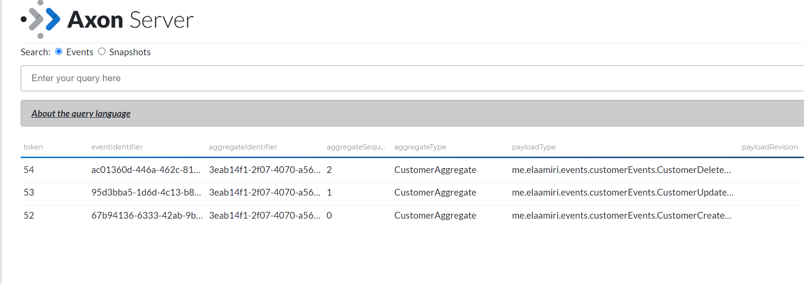

# examen-microservices-distributed-systems

|ENSET-M|II-BDCC 2|EL AAMIRI Essadeq|
|---|---|---|

Développer les fonctionnalités qui vous semblent les plus importantes pour ce projet et rendre un
rapport et le code source de l’application répondant aux questions suivantes :


# Établir une architecture technique du projet


# Établir un diagramme de classe global du projet


# Déployer le serveur AXON Server ou KAFKA Broker


# Développer le micro-service Customer-Service
## Command side
### Commands 

- CreateCustomerCommand
```java
package me.elaamiri.commands.customerCommands;

import lombok.Getter;
import me.elaamiri.commands.BaseCommand;

public class CreateCustomerCommand extends BaseCommand<String> {

    @Getter
    private String nom;
    @Getter
    private String adresse;
    @Getter
    private String email;
    @Getter
    private String telephone;

    public CreateCustomerCommand(String id, String nom, String adresse, String email, String telephone) {
        super(id);
        this.nom = nom;
        this.adresse = adresse;
        this.email = email;
        this.telephone = telephone;
    }
}

```

- UpdateCustomerCommand
```java
package me.elaamiri.commands.customerCommands;

import lombok.Getter;
import me.elaamiri.commands.BaseCommand;

public class UpdateCustomerCommand extends BaseCommand<String> {
    @Getter
    private String nom;
    @Getter
    private String adresse;
    @Getter
    private String email;
    @Getter
    private String telephone;

    public UpdateCustomerCommand(String id, String nom, String adresse, String email, String telephone) {
        super(id);
        this.nom = nom;
        this.adresse = adresse;
        this.email = email;
        this.telephone = telephone;
    }
}

```


- DeleteCustomerCommand
```java
package me.elaamiri.commands.customerCommands;

import me.elaamiri.commands.BaseCommand;

public class DeleteCustomerCommand extends BaseCommand<String> {
    public DeleteCustomerCommand(String id) {
        super(id);
    }
}

```


### Events 

- CustomerCreatedEvent
```java
package me.elaamiri.events.customerEvents;

import lombok.Getter;
import me.elaamiri.events.BaseEvent;

public class CustomerCreatedEvent extends BaseEvent<String> {
    @Getter
    private String nom;
    @Getter
    private String adresse;
    @Getter
    private String email;
    @Getter
    private String telephone;

    public CustomerCreatedEvent(String id, String nom, String adresse, String email, String telephone) {
        super(id);
        this.nom = nom;
        this.adresse = adresse;
        this.email = email;
        this.telephone = telephone;
    }
}

```


- CustomerUpdatedEvent
```java
package me.elaamiri.events.customerEvents;

import lombok.Getter;
import me.elaamiri.events.BaseEvent;

public class CustomerUpdatedEvent extends BaseEvent<String> {
    @Getter
    private String nom;
    @Getter
    private String adresse;
    @Getter
    private String email;
    @Getter
    private String telephone;

    public CustomerUpdatedEvent(String id, String nom, String adresse, String email, String telephone) {
        super(id);
        this.nom = nom;
        this.adresse = adresse;
        this.email = email;
        this.telephone = telephone;
    }
}

```


- CustomerDeletedEvent
```java
package me.elaamiri.events.customerEvents;

import me.elaamiri.events.BaseEvent;

public class CustomerDeletedEvent extends BaseEvent<String> {
    public CustomerDeletedEvent(String id) {
        super(id);
    }
}

```

### Dtos

- CreateCustomerRequestDTO
```java
package me.elaamiri.dtos.customerDtos;

import lombok.*;

@Data
@AllArgsConstructor @NoArgsConstructor @Builder
public class CreateCustomerRequestDTO {

    private String nom;

    private String adresse;

    private String email;

    private String telephone;
}

```


- UpdateCustomerRequestDTO
```java
package me.elaamiri.dtos.customerDtos;


@Data
@AllArgsConstructor
@NoArgsConstructor
@Builder
public class UpdateCustomerRequestDTO {
    private String nom;

    private String adresse;

    private String email;

    private String telephone;
}

```

### Aggregate

- CustomerAggregate
```java
package me.elaamiri.customerservice.command.aggregates;

@Aggregate
@Slf4j
public class CustomerAggregate {

    @AggregateIdentifier
    @Getter
    private String id;
    @Getter
    private String nom;
    @Getter
    private String adresse;
    @Getter
    private String email;
    @Getter
    private String telephone;

    public CustomerAggregate() {
    }

    @CommandHandler
    public CustomerAggregate(CreateCustomerCommand command) {
        // validations

        AggregateLifecycle.apply(new CustomerCreatedEvent(
                command.getId(),
                command.getNom(),
                command.getAdresse(),
                command.getEmail(),
                command.getTelephone()
        ));
    }

    @EventSourcingHandler
    public void on(CustomerCreatedEvent event){
        this.id = event.getId();
        this.nom = event.getNom();
        this.adresse = event.getAdresse();
        this.email = event.getEmail();
        this.telephone = event.getTelephone();
    }

    @CommandHandler
    public void handle(UpdateCustomerCommand command){
        // validations
        if(command.getId() == null || command.getId().isBlank()) throw new EntryNotFoundException("Customer Not found");
        AggregateLifecycle.apply(new CustomerUpdatedEvent(
                command.getId(),
                command.getNom(),
                command.getAdresse(),
                command.getEmail(),
                command.getTelephone()
        ));
    }

    @EventSourcingHandler
    public void on(CustomerUpdatedEvent event){
        this.id = event.getId();
        this.nom = event.getNom();
        this.adresse = event.getAdresse();
        this.email = event.getEmail();
        this.telephone = event.getTelephone();
    }


    @CommandHandler
    public void handle(DeleteCustomerCommand command){
        if(command.getId() == null || command.getId().isBlank()) throw new EntryNotFoundException("Customer Not found");
        AggregateLifecycle.apply(new CustomerDeletedEvent(
                command.getId()
        ));
    }

    @EventSourcingHandler
    public void on(CustomerDeletedEvent event){
        log.warn("Deleting Customer: "+ event.getId());
    }
}

```

### Controller
- CustomerCommandController
```java
package me.elaamiri.customerservice.command.controllers;

@RestController
@AllArgsConstructor
@RequestMapping("/commands/customer")
public class CustomerCommandController {
    private CommandGateway commandGateway;

    @PostMapping("/create")
    public CompletableFuture<String> create(@RequestBody CreateCustomerRequestDTO customerRequestDTO){
        CompletableFuture<String> response = commandGateway.send(
                new CreateCustomerCommand(
                        UUID.randomUUID().toString(),
                        customerRequestDTO.getNom(),
                        customerRequestDTO.getAdresse(),
                        customerRequestDTO.getEmail(),
                        customerRequestDTO.getTelephone()
                )
        );

        return  response;

    }

    @PutMapping("/update/{id}")
    public CompletableFuture<String> update(@RequestBody UpdateCustomerRequestDTO customerRequestDTO, @PathVariable String id){
        CompletableFuture<String> response = commandGateway.send(
                new UpdateCustomerCommand(
                        id,
                        customerRequestDTO.getNom(),
                        customerRequestDTO.getAdresse(),
                        customerRequestDTO.getEmail(),
                        customerRequestDTO.getTelephone()
                )
        );

        return  response;

    }

    @DeleteMapping("/delete/{id}")
    public CompletableFuture<String> delete( @PathVariable String id){
        CompletableFuture<String> response = commandGateway.send(
                new DeleteCustomerCommand(
                        id
                )
        );

        return  response;

    }
}

```

### Tests

- Our service in Axon 


- Create Customer 


- Update Customer


- Delete Customer 


- All 3 events




## Query side 


- 
```java

```

5. Développer le micro-service Inventory-Service
6. Développer le micro-service Order-Service
7. Mettre en place les services techniques de l’architecture micro-service (Gateway, Eureka ou
Consul Discovery service, Config Service)
8. Développer un micro-service qui permet faire du Real time Data Analytics en utilisant Kafka
Streams (Nombre et total des commandes sur une fenêtre temporelle de 5 secondes)
9. Développer votre application Frontend avec Angular ou React
10. Sécuriser votre système avec un système de d’authentification OAuth2, OIDC avec Keycloak
ou un service d’authentification basé sur Spring Security et JWT
11. Écrire un script docker-compose.yml pour le déploiement de ce système distribué dans des
conteneurs docker.